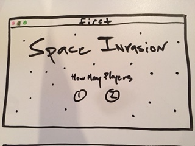

# Space Invasion

# [Trello](https://trello.com/b/FAOkPqPi/project-1-practice)

## Minimum Viable Product
The object of the game is to eliminate the aliens off the screen before you are eliminated by them! As a player, you are given three tries (lives) to win. If the aliens are not eliminated before those three tries are used, then the player has the option to reset the game to try again.

## Technologies Used

[HTML5 Canvas](https://developer.mozilla.org/en-US/docs/Web/API/Canvas_API)

[CSS](https://developer.mozilla.org/en-US/docs/Web/CSS)

[Javascript](https://developer.mozilla.org/en-US/docs/Web/JavaScript)

[jQuery](https://jquery.com)

## Approach Taken

The development of this game began with creating a HTML5 canvas that took up the majority of the viewport. From there I began animating objects across the screen that eventually became images. These images were then set to move in sync across the screen. After the aliens were properly rendered, the fighter was created and given the ability to shoot virtual projectiles towards the aliens. A little research on collision detection using HTML5 canvas added to the interactivity of the game. The game really came to life as the virtual projectiles from the aliens were randomized and the same collision detection was applied to the player's fighter. This simulated a win-loss scenario for the player. A "game-over" and "win" alert was eventually added to complete the game.

## Installation Instructions

Clone the repository at https://github.com/MichaelRCruz/space_invasion and then open the index.html file.

The game has been optimized for [Google Chrome](https://www.google.com/chrome/) only.

## Next Steps

The game should keep score with a two-player option.

The aliens should become more aggressive as the player moves through levels (worlds).

Develop a more sophisticated barrier deterioration feature.

Focus on the three major factors that support game-play quality:
1. alien speed increasing at a linear rate
2. alien bullets increasing at an exponential rate
3. balancing barrier deterioration with the two aforementioned factors

## [Give it a try!](https://michaelrcruz.github.io/space_invasion/)
